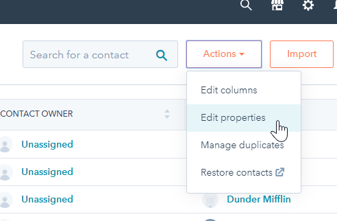
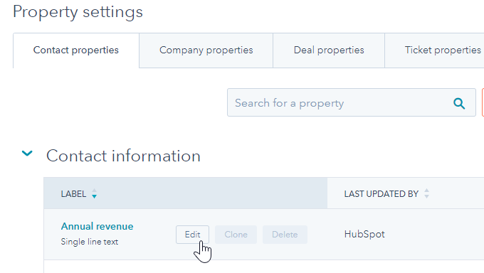
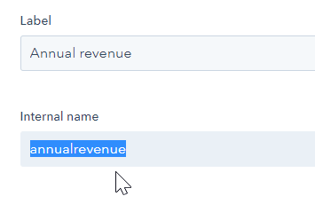

# Hubspot extractor  
  
KBC Component for data retrieval from [Hubspot API](https://developers.hubspot.com/docs/overview).  
  
**Table of contents:**  
  
[TOC]
  
# Configuration
### **API token** 
[REQ] Your Hubspot API token, for more information see here ([how-do-i-get-my-hubspot-api-key](https://knowledge.hubspot.com/articles/kcs_article/integrations/how-do-i-get-my-hubspot-api-key))

### **Period from date [including]** 

[OPT] Date marking start of the period for incremental loads, only records created/modified in that period are retrieved. Accepts date in `YYYY-MM-DD` format or relative textual values like `today`,`yesterday`, `1 day ago`, `1 month ago`, etc. If left empty all records are downloaded. **NOTE** that this parameter affects only some of the endpoints specifically: 
- `contacts` - The endpoint only scrolls back in time 30 days.
- `deals` - This endpoint will only return records modified in the last 30 days, or the 10k most recently modified records.
- `email_events`- not limited
- `activities` - this is [Engagements API](https://developers.hubspot.com/docs/methods/engagements/engagements-overview) in Hubspot jargon. This endpoint will only return records updated in the last 30 days, or the 10k most recently updated records.
- `companies` - This endpoint will only return records updated in the last 30 days, or the 10k most recently updated records.

### Endpoints
List of endpoints to download. Currently supported are:

- Deals  
- Pipelines  
- Campaigns  
- Email Events  
- Activities (Engagements)  
- Contact Lists  
- Owners  

For more info see the **Supported endpoints** section

### Incremental output

Set this parameter to `true` if you wish to output data incrementally - i.e. to upsert new data to the result table based on the primary key.

#### **Deleted records** 

It is important to mention that HubSpot API **does not** return deleted records. That means that even though some tables like `deals` will 
contain `isDeleted` field, it's value will be always `False`. To keep track of deleted records you need to:
- set Incremental Output to False
- remove any value in `Period from date` parameter to retrieve the full history of reccords.

### **Additional Property attributes**
Additional attributes that are fetched for each specified property. Applies only for `companies`,`contacts` and `deals` endpoint, for which it is possible to define a list of additional properties.

- **`Include source attribute`** - includes additional attributes `[property_name]_source` and `[property_name]_sourceId` that specify the method by which the value was set.
- **`Include timestamp attribute`** -  includes additional attributes `[property_name]_timestamp` A Unix timestamp (in milliseconds) of the time the property was last set.
- **`Include attribute versions`** - includes additional attributes `[property_name]_timestamp` A list of previous versions of the property. The first item in the list will be the current version. This field contains a JSON array value.

### Additional properties

- **Company properties** - [OPT] Additional list of properties, names must match with api names as specified by [Company Properties](https://developers.hubspot.com/docs/methods/companies/company-properties-overview).  The endpoint must be listed in `endpoints` parameter for this to take effect. 
- **Contact properties** -[OPT]  Additional list of properties, names must match with api names as specified by [Deal Properties](https://developers.hubspot.com/docs/methods/deals/deal_properties_overview)  The endpoint must be listed in `endpoints` parameter for this to take effect. 
- **Deal properties** - [OPT] Additional list of properties, names must match with api names as specified by [Deal Properties](https://developers.hubspot.com/docs/methods/deals/deal_properties_overview)  The endpoint must be listed in `endpoints` parameter for this to take effect. 

#### How to find internal name of a property

- In the UI navigate to Contacts, Deals or Companies
- In the top right corner choose `Actions` -> `Edit properties`



- Hover over required property and click `Edit`



- Look for `Internal name`, this is what you need to include in the `Additional properties field`


 
# Functionality  
Supports retrieval from several endpoints. Some endpoints allow retrieval of recently updated records,   
this is set by `Date From` parameter. In most of the cases maximum of last 30 days can be retrieved.  
  
# Supported Endpoints  
- [Companies](#Companies)  
**Result tables** : `companies`  
- [Contacts](#Contacts)  
**Result tables** : `contacts`, `contacts_form_submissions`, `contacts_lists`, `contacts_identity_profile_identities`, `contacts_identity_profiles`  

- [Deals](#Deals)  
**Result tables** : `deals`, `deals_stage_history`, `deals_contacts_list`, `deals_assoc_deals_list`, `deals_assoc_companies_list`  
- [Pipelines](#Pipelines)  
**Result tables** : `pipelines`, `pipeline_stages`

- [Campaigns](#Campaigns)  
**Result tables** : `campaigns`

- [Email Events](#Email Events)  
**Result tables** : `email_events`
- [Activities (Engagements)](#Engagements)    
**Result tables** : `activities`
- [Lists](#Contact Lists)    
**Result tables** : `lists`  
- [Owners](#Owners)    
**Result tables** : `owners`
  
## Companies   
  [All companies](https://developers.hubspot.com/docs/methods/companies/get-all-companies) or   
 [recently modified (last 30 days) ](https://developers.hubspot.com/docs/methods/companies/get_companies_modified) can be retrieved.   
 NOTE: Fetches always 30 day period  
   
 Following Company properties are fetched by default:  
    
```python  
 ["about_us", "name", "phone", "facebook_company_page", "city", "country", "website", "industry", "annualrevenue", "linkedin_company_page", "hs_lastmodifieddate", "hubspot_owner_id", "notes_last_updated",   
"description", "createdate", "numberofemployees", "hs_lead_status", "founded_year", "twitterhandle", "linkedinbio"]
```  

Custom properties may be specified in configuration, names must match with api names as specified by [Company Properties](https://developers.hubspot.com/docs/methods/companies/company-properties-overview)  

**Result tables** : 

- `companies`     
  
## Contacts      

 [All contacts](https://developers.hubspot.com/docs/methods/contacts/get_contacts) or   
 [recently modified (max last 30 days) ](https://developers.hubspot.com/docs/methods/contacts/get_recently_updated_contacts) can be retrieved.   
 Recently modified period can be limited by `Date From` parameter   
   
 Following Contact properties are fetched by default:  
    
```json  
 ["hs_facebookid", "hs_linkedinid", "ip_city", "ip_country", "ip_country_code", "newsletter_opt_in", "firstname", "linkedin_profile", "lastname", "email", "mobilephone", "phone", "city", "country", "region", "jobtitle",   
 "company", "website", "numemployees", "industry", "associatedcompanyid", "hs_lead_status",   
 "lastmodifieddate", "source", "hs_email_optout", "twitterhandle", "lead_type", "hubspot_owner_id",   
 "notes_last_updated", "hs_analytics_source", "opt_in", "createdate", "hs_twitterid", "lifecyclestage"]  
```  
  
  **Note:** Following properties will be fetched each time, regardless configuration and with option `propertyMode=value_and_history`. This is currently hardcoded and   
 all other properties are fetched with value only:  
   
```json  
 ["company", "firstname", "lastmodifieddate", "lastname"]
```
   
  Custom properties may be specified in configuration, names must match with api names as specified by [Contact Properties](https://developers.hubspot.com/docs/methods/contacts/contact-properties-overview)  
   
**Result tables** : 

- `contacts`
- `contacts_form_submissions`
- `contacts_lists`
- `contacts_identity_profile_identities`
- `contacts_identity_profiles`  

## Deals      
 [All deals](https://developers.hubspot.com/docs/methods/deals/get-all-deals) or   
 [recently modified (last 30 days) ](https://developers.hubspot.com/docs/methods/deals/get_deals_modified) can be retrieved.   
 NOTE: Fetches max 30 day period, larger periods are cut to match the limit.  
   
 Following Deal properties are fetched by default:  
    
```json  
["authority", "budget", "campaign_source", "hs_analytics_source", "hs_campaign", "hs_lastmodifieddate", "need", "timeframe", "dealname", "amount", "closedate", "pipeline", "createdate", "engagements_last_meeting_booked", "dealtype", "hs_createdate", "description", "start_date", "closed_lost_reason", "closed_won_reason", "end_date", "lead_owner", "tech_owner", "service_amount", "contract_type", "hubspot_owner_id", "partner_name", "notes_last_updated"]  
```  
  Custom properties may be specified in configuration, names must match with api names as specified by [Deal Properties](https://developers.hubspot.com/docs/methods/deals/deal_properties_overview)  
   
**Result tables** : 

- `deals`
- `deals_stage_history`
- `deals_contacts_list`
- `deals_assoc_deals_list`
- `deals_assoc_companies_list` 
 
## Pipelines  
[All pipelines](https://developers.hubspot.com/docs/methods/pipelines/get_pipelines_for_object_type) - gets all pipelines and its stages.  
  
**Result tables** : 

- `pipelines`
- `pipeline_stages`  
  
## Campaigns  
[All Campaigns](https://developers.hubspot.com/docs/methods/email/get_campaigns_by_id)   
  
NOTE: Fetches max 30 day period  

**Result tables** : 

- `campaigns`
  
## Email Events  
[All Email Events](https://developers.hubspot.com/docs/methods/email/get_events)  - possible to limit by `Date From` parameter.  
  
NOTE: Fetches max 30 day period, larger periods are cut to match the limit.  

**Result tables** : 

- `email_events`
   
## Activities (Engagements) 

[All Activities](https://developers.hubspot.com/docs/methods/engagements/get-all-engagements) or   
 [recently modified (max last 30 days) ](https://developers.hubspot.com/docs/methods/engagements/get-recent-engagements) -   
 possible to limit by `Date From` parameter.  
  
NOTE: Fetches max 30 day period, larger periods are cut to match the limit.  

**Result tables** : 

- `activities`
  
## Lists  
[All Lists](https://developers.hubspot.com/docs/methods/lists/get_lists)   
  
NOTE: Always fetches all available lists  

**Result tables** : 

- `lists`  
   
## Owners  
[All owners](https://developers.hubspot.com/docs/methods/owners/get_owners)   
  
NOTE: Always sets `include_inactive` to `True`  

**Result tables** : 

- `owners`

# Development  
  This example contains runnable container with simple unittest. For local testing it is useful to include `data` folder in the root  
and use docker-compose commands to run the container or execute tests.   
  
If required, change local data folder path to your custom:  
  
```yaml  
 volumes: - ./:/code - ./CUSTOM_FOLDER:/data
```
  
Clone this repository and init the workspace with following command:  
  
```  
git clone https://bitbucket.org:kds_consulting_team/kds-team.ex-hubspot-crm.git  
cd kds-team.ex-hubspot  
docker-compose build  
docker-compose run --rm dev  
```  
  
Run the test suite and lint check using this command:  
  
```  
docker-compose run --rm test 
```  

# Integration  
  
For information about deployment and integration with KBC, please refer to the [deployment section of developers documentation](https://developers.keboola.com/extend/component/deployment/)